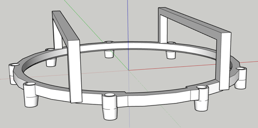
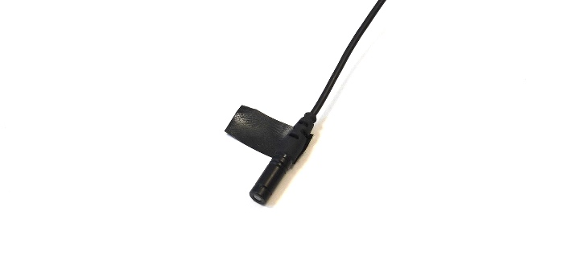
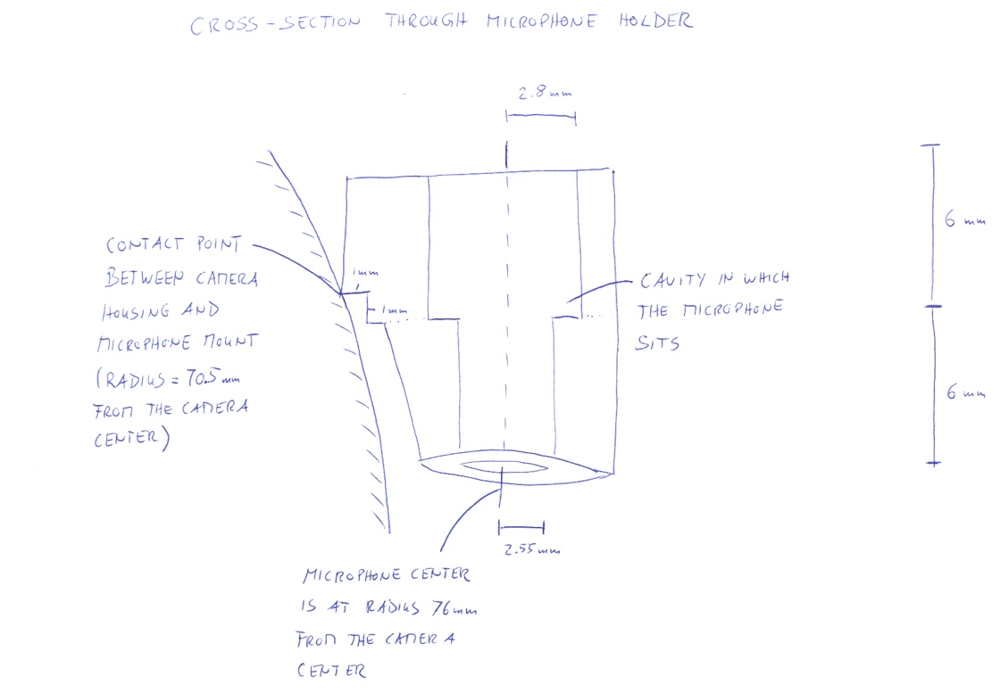

# The Microphone Mount

This folder comprises the 3D model of the microphone mount, which was created in SketchUp and 3D printed. The mount is designed for 9 pcs. of Røde Lavalier GO omnidirectional lapel microphones. To fit the microphones into the mount, wrap the microphone bodies 1.5 times with eletrical tape such that the edge of the tape coincides with the step of the radius of the cylindrical microphone body that occurs at the pull relief. See the following picture:

This way, the microphones sit firmly in the correct position and do not require any further securing. 

We used the same tape for taping the microphone wires against the camera body. We also recommend taping the mount onto the camera because it may otherwise move when the camera is being moved. Refer also to the title photo of this repository to see this. 

As our experience with 3D modelling and 3D printing are limited, we see potential for improvement of the design:

* Currently, there is a gap with a width of approx. 2 mm between the microphone diaphragms and the camera surface. It is not critical, but it may be possible to either angle the microphones such that their tips end up close to the camera surface, or, it may be possible to keep them vertical but move them closer.
* The microphones all sit on a ring that sits of the camera housing. The ring is partly visible to the cameras so that it occludes the field of view in upward direction. It may be possible to avoid this by placing the ring higher up and add arms to it on which the cameras sit.
* It may be useful add cables holders to the design so that the cables do not need to be taped. 
* It may be possible to come up with a design that allows for strapping the mount onto the camera so that no taping is required at all. 

Here are a couple more details that'll help you improving the design if aim for that:

* Radius of the circle along which the camera housing and the microphone mount have contact: 70.5 mm
* Radius of the circle through the centers of the microphones: 76 mm
* The underside of the horizontal bars across the camera housing is 29 mm above the circle along which the camera housing and the microphone mount have contact.
* All beam-like parts have a 6 mm x 6 mm cross-section.
* Here is a vertical cross-section through the microphone holders:

If you happen to be able to produce an improved design, then please let us know at jens.ahrens@chalmers.se!