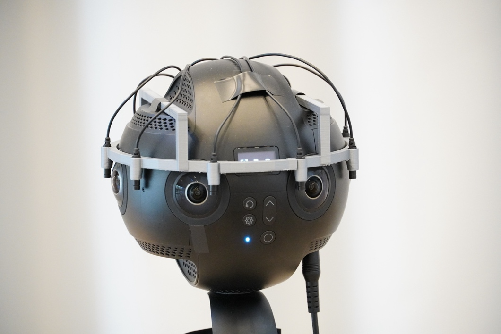

# Experimental 4th-Order Ambisonic Microphone Array for the Insta360 Pro Camera

This repository comprises resources related to the 4th ambisonic order microphone array prototype that we created for the Insta360 Pro camera. Here is a demonstration video of it: https://youtu.be/5jAu47l2WaY

The folder `3d_model` comprises resources related to the design of the microphone mount. The folder `signal_processing` comprises resources related to the processing of the signals that the microphones of the array capture. You will also find the raw signals there from which the above demonstration video was created.  The scripts have been created for MATLAB. Minor tweaks are required for making some them work on Octave. We'll provide that shortly. See [this](https://github.com/AppliedAcousticsChalmers/ambisonic-encoding/commit/76088d25df88498b9505526ae59e62d48b10267b) commit to get an idea of what kind of edits are required. The MagLS rendering has not been tested with Octave. But we'll do that shortly, too.

When using these resources, please cite the following paper in which we presented the prototype for the very first time:

    J. Ahrens and K. Jaruszewska, "Case Study of Equipping a High-Fidelity 360 Camera 
    with a 4th-Order Equatorial Ambisonic Microphone Array," 154th Convention of the AES, 
    Espoo, Finland (2023). 
    
Find a pdf of the paper [here](https://research.chalmers.se/publication/535721/file/535721_Fulltext.pdf).

## License
The content of this repository is licensed under the terms of the MIT license. Please consult the file [LICENSE](LICENSE) for more information about this license.